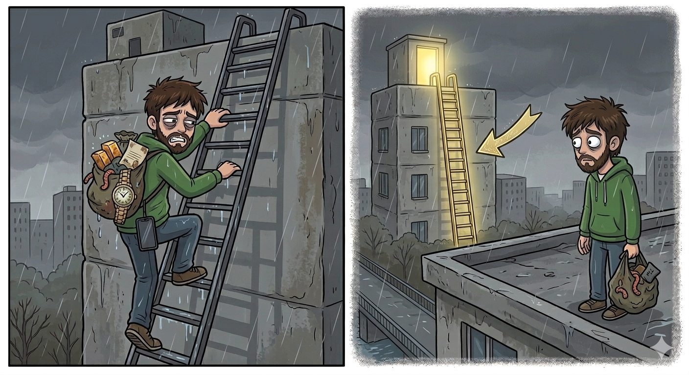

# ¿A qué valores concedemos más importancia?

## La mayoría de las personas busca valores que den sentido a su vida

- ¿Se han fijado en cómo funcionan hoy las redes sociales o las cámaras de nuestros teléfonos? 
- Casi todos tienen "filtros". Con un solo clic, podemos hacer que un paisaje nublado parezca un día radiante, o que una cara cansada se vea perfecta.

  

- Pero hay un detalle: **el filtro no cambia la realidad, solo cambia la forma en que tú y los demás lo ven.**

- En la vida real, todos tenemos un "filtro mental". 
- Ese filtro son **nuestros valores**. 
- Nuestros valores son el lente a través del cual miramos el mundo y decidimos qué merece nuestro tiempo y qué no. 
- El peligro es que el mundo nos ofrece varios "filtros" que hacen que:
	- Las cosas temporales parezcan eternas
	- Y que las metas vacías parezcan llenas de significado. 

  

- Si no tenemos cuidado, podemos pasar toda la vida persiguiendo algo que se ve brillante a través de nuestro filtro, pero que en realidad no tiene valor.

---
- Es normal que queramos que nuestra vida "valga la pena". 
- Jehova nos hizo así, tal como dice **Eclesiastés 2:24a**
	- El ser humano busca satisfacción en su duro trabajo. 
	
- No fuimos creados para ser robots que solo cumplen tareas; fuimos diseñados para sentir el placer del logro, para tener metas que nos den una razón para levantarnos cada mañana.
- Ahora bien, como definimos esas metas?
--- 
- Nuestras metas no aparecen de la nada. Son el resultado directo de lo que valoramos.

	- Si usted usa el **"filtro de la seguridad económica"**, su prioridad será acumular posesiones materiales, para tener mucho dinero.
	- Si usa el **"filtro del estatus"**, su meta será obtener fama o un puesto de poder.

- Como se habrá dado cuenta, el problema es que, si el filtro está distorsionado, nos pondremos metas equivocadas. 

- Por eso, el apóstol Pablo nos da un consejo de supervivencia en **Filipenses 1:10**: 
	- _"Asegúrense de las cosas más importantes"_. 
- No dice "asegúrense de las cosas más urgentes" o "de las que todos buscan", sino de las que tienen **valor real**.
---
- Y hacer esto es muy importante, y debemos hacerlo lo mas antes posible.
- Imagínese esforzarse toda la vida por alcanzar una meta, y cuando lo logramos, descubrimos que esta vacía.
- Es como subir una escalera con mucho esfuerzo para darte cuenta, al llegar arriba de que era la equivocada, la escalera correcta era la de otro edificio. 

  

- No queremos que nos pase eso, y Jehova tampoco.
- Por eso, para no caer en esa trampa, analicemos ahora qué filtros nos está vendiendo el mundo hoy y por qué suelen ser un engaño.

## Las metas que busca la mayoría de la gente reflejan los valores del mundo

### El Espejismo de las Riquezas (3 min)

- Muchos ven el dinero como el valor supremo. 
- Piensan: _"Si tengo suficiente dinero, estaré seguro"_. 
- Por eso, sus metas son un empleo de alto rango o inversiones constantes. 
- Pero el dinero es un pésimo guardián.

- **Ilustración:** El dinero es como el agua salada para un náufrago: cuanta más bebe para calmar la sed, más sed le da.
    
- Leamos **Proverbios 23:4, 5**

>[!versiculo] Proverbios 23:4, 5
>No te desvivas consiguiendo riquezas. Detente y muestra que tienes entendimiento. Cuando pones los ojos en ellas, desaparecen, porque sin falta les saldrán alas como las del águila y se irán volando por el cielo

- Este texto enseña que las riquezas son **engañosas e inestables**, recordándonos que dedicar toda nuestra energía a acumularlas es una falta de sabiduría
- Pues pueden desaparecer tan rápido como un águila que emprende el vuelo.
    
- **Analicemos el ejemplo que puso Jesús para entender este punto:** 
- En **Lucas 12:15-21**, Jesús habló de un hombre rico que tenia graneros para guardar su riqueza
- Pero su manera de ver las cosas era la equivocada, decidió construir graneros más grandes porque quería mas.
- Pero el no sabia que iba a morir esa misma noche. 
- Su error no fue ser trabajador, sino creer que su vida dependía de sus bienes. 
- Podemos aprender esta lección:
	- **Las metas materiales tienen fecha de caducidad.**
	- Debemos mostrar **entendimiento** al no poner nuestra seguridad en algo temporal.
### La Trampa de la Fama y la Prominencia

- Muchas personas quieren llegar a ser alguien en este mundo, quieren ser reconocidos y famosos.
- Por esa razon muchos buscan educación superior no para aprender, o poder conseguir un trabajo
- Sino que lo hacen para subir de status, y creerse mejor que los demás.
- Quieren cultivar habilidades no para ayudar a lo demás, sino para ser "alguien importante", para sentirse superiores al resto.
--- 
- Pero que opinara Jehova al respecto?
- El nos lo hace saber en **1 Corintios 3:18, 19:**
>[!versiculo] 1 Corintios 3:18, 19
>Que nadie se engañe: si alguno de ustedes piensa que es sabio en este sistema, que se haga ignorante para que llegue a ser sabio. 
>
>Porque para Dios la sabiduría de este mundo es absurda, pues está escrito: “Él atrapa a los sabios en su propia astucia

- Notaron? En este texto Jehova prácticamente nos dice: 
	- Despierten! No usen ese filtro, esa forma de pensar esta mal!  
	- La sabiduría de este mundo es absurda!
	- E invertir TODO nuestro tiempo y esfuerzo para conseguirla es en vano, NO LO HAGAN!
- Queridos hermanos y hermanas, Jehova sabe lo que dice, el vio a muchas personas que persiguieron esta meta a lo largo de la historia.
- Y aunque muchos la alcanzaron al final no ganaron nada que valga la pena.
- Como dice **Eclesiastés 2:16**:
	- al sabio del mundo se le olvida igual que al tonto. 

- La fama no puede comprar ni un minuto más de vida. 
- Es como un aplauso en un estadio vacío: suena fuerte un momento, y luego solo queda el silencio.

### La Obsesión por el Entretenimiento

- Vivimos en un mundo donde tenemos muchas actividades para entretenernos:
- Puede que pensemos en: 
	- cual sera nuestro proximo viaje
	- cual sera el siguiente videojuego que vamos a comprar
	- ya salieron a la venta las entradas para ir al cine o algún concierto
	- ya reservaron la cancha para ir jugar?

- Estas actividades no son malas
	- Un viaje es algo muy divertido
	- Ver una buena pelicula nos hace pasar un buen rato
	- Y el deporte nos ayuda a tener una buena salud

- El problema es cuando estas actividades y el planearlas ocupan toda nuestra mente y siempre estamos pensando en eso.
- Puede que solo vayamos de vacaciones una vez al año, pero si TODO EL TIEMPO, estamos pensando en ellas, es un problema.
- Ya que le estamos dando mas importancia de lo que deberíamos.

- Esa mentalidad puede llevarnos a desarrollar amor a los placeres
- Es como el azúcar: da energía un momento, pero luego te deja más cansado y vacío que antes.
- Jehova nos advirtió de este peligro en **Proverbios 21:17:**

>[!versiculo] Proverbios 21:17
>El que ama la diversión acabará en la pobreza

- Y es interesante que esta pobreza no solo es material, sino también espiritual.
- Queridos hermanos y hermanas, quedémonos con este punto:
	- El entretenimiento es un excelente _descanso_, pero un pésimo _destino_
	- No queremos que sea nuestra meta
---
- Si las riquezas vuelan, la fama se olvida y el placer se evapora... 
- **¿qué es lo que realmente permanece?**
- **Cual es una buena meta que vale la pena esforzarse por alcanzar?**
- Pues vamos a descubrirlo juntos

## La superioridad de los principios bíblicos

- Hay una verdad innegable: **sin vida, nada más tiene valor.**
- Puede que tengamos una cuenta bancaria llena de dinero, pero si estamos bajo tierra en un cementerio, ese dinero no vale nada. Ya que no podemos gastarlo.
- Entonces, lo que realmente tiene valor es lo que nos conecta con la Fuente de la vida.
- Hubo un rey que sabia esto y lo puso por escrito, era David, leamos **Salmo 63:3:**

>[!versiculo] Salmo 63:3
> Tu amor leal es mejor que la vida; por eso mis propios labios te darán gloria.

- Por que David escribió que el amor leal de Jehova, es mejor que la vida?
- Pensemos en esta ilustración: 
	- Imaginen un aparato electrónico ultimo modelo. Puede tener muchas funciones, pero si no está conectado a la energía o si su batería muere, es solo un trozo de metal. 
	- Nosotros somos iguales; nuestra "energía" y propósito real vienen de estar conectados con Jehová. De tener una amistad con el.  
- Si somos sus amigos Jehova no solo nos promete una vida eterna, nos promete una vida con sentido, ahora y el futuro.

- Y como podemos llegar a ser amigos de Jehova? 
- Pues el uso a uno de sus amigos para darnos esa información, leamos lo que escribió Juan, en Juan 17:3, ahi dice:

>[!versiculo] Juan 17:3
>Esto significa vida eterna: que lleguen a conocerte a ti, el único Dios verdadero, y a quien tú enviaste, Jesucristo.

- Juan lo dejo muy claro, si queremos ser amigos de Jehova necesitamos conocerlo.
- Esto implica saber:
	- cuales son sus normas, su propósito
	- para así adquirir sabiduría y entendimiento.
- Y esta sabiduría de Jehova es muy diferente a la sabiduría de este mundo, veamos por que
---

- El mundo nos enseña a "agarrar" y "acumular".
- La Biblia nos enseña a "soltar" y "dar".
- Es interesante...
	- Mientras el mundo mide el éxito por lo que tienes en el garaje
	- Dios lo mide por lo que tienes en el corazón.
- Y Jehova quería que tengamos esta idea bien solida, por eso inspiro a Pablo para que lo deje por escrito, leamos **1 Timoteo 6:17:**

>[!versiculo] 1 Timoteo 6:17
>Dales estas instrucciones a los que son ricos en este sistema: que no se crean superiores y que no pongan su esperanza en las riquezas inseguras, sino en Dios, que nos suministra abundantemente todo lo que disfrutamos.

-  Notaron? Jehová nos manda a no ser arrogantes ni poner nuestra esperanza en riquezas inestables
- Y a cambio que debemos hacer? Sigamos leyendo...

>[!versiculo] 1 Timoteo 6:18
>Diles que hagan el bien, que sean ricos en buenas obras, que sean generosos y que estén dispuestos a compartir

- Si... Jehova no quiere que seamos egoístas y pensemos en nosotros TODO el tiempo.
- Sino, pensar en:
	- Como puedo ayudar a los demás? 
	- Hay algún hermano o hermana que necesite mi ayuda?
	- Puedo dar de mi tiempo, energías, y cosas valiosas para apoyar el Reino de Dios?
- Pues Jehova espera que nos hagamos estas preguntas, y obremos de acuerdo a nuestras circunstancias personales
- Recuerde Jehová nunca nos va exigir algo que no podamos cumplir
- Y cual sera la recompensa si hacemos esto? Sigamos leyendo...

>[!versiculo] 1 Timoteo 6:19
>y así ellos se conseguirán un tesoro, unos buenos cimientos para el futuro, para que logren aferrarse a la vida que realmente es vida.

- Si usted toma ahora las decisiones correctas, la vida eterna esta a su alcance.
- Ahora bien, Pablo también hablo de un tesoro, este tesoro se almacena en un banco que nunca va quebrar, este banco existió desde hace mucho tiempo
- A que nos estamos refiriendo?
---
- Bueno, para entender esta idea:
	- Hablemos del **espejismo del reconocimiento** que mencionamos antes.
- Sin duda todos queremos ganarnos una **buena reputación**, de hecho ganársela conlleva mucho tiempo y esfuerzo.
- Uno debe ser muy paciente para conseguirla.
- ¿Quién se acuerda del hombre más rico del mundo de hace 200 años?
	- Casi nadie, y si lo recordamos probablemente solo sepamos su nombre y algunos detalles de su vida.
- Pero Jehova tiene una memoria perfecta para sus siervos leales. 
- El recuerda cada detalle de todos sus siervos
- Por eso preguntémonos: 
	- Me estoy ganando una buena reputación SOLO ante las personas?
	- O estoy construyendo una vida que Jehova recuerde y le tenga mucho aprecio?
- No lo olvide, los seres humanos olvidan rápido, pero Jehova es diferente
- Leamos **Malaquías 3:16**

>[!versiculo] Malaquías 3:16
> En ese tiempo, los que temían a Jehová se pusieron a hablar entre ellos, cada uno con su compañero, y Jehová siguió prestando atención y escuchando. Y ante él se escribió un libro para recordar a los que temen a Jehová y a los que meditan en su nombre.

- Su nombre esta en ese libro?
	- Aquí leemos que este libro es para recordar a los que tienen una buena reputación ante Jehova.
	- Queremos estar en este libro, esa es NUESTRA META
- No gastamos todo nuestro tiempo y energías para:
	- ser famosos
	- ser millonarios
	- divertirnos sin importarnos nada mas.
- Esas cosas no tienen un valor real, es solo un filtro

- Nuestra meta es estar en este libro, que Jehova atesore tu nombre.
	- Jehova no solo va a recordar como te llamas, el recordara cada detalle de vos
	- Tus gustos, tu personalidad, todas las veces que le fuiste leal.
	- Y sabes que es lo mejor, que lo va a recordar con cariño.
	- Ya que serás su amigo intimo.
	- Y si pierdes la vida, Jehova te la devolverá, para que vivas para siempre.

- Quedémonos con esa idea: 
- El placer del mundo es como un fuego artificial: brilla un segundo y pero luego solo deja humo. 

  

- El gozo de servir a Jehova es como la luz del sol: brilla constante y nos da calor todos los días.

  

---
- Muy bien, ya tenemos identificada cual es nuestra meta
- Pero eso no es suficiente, ahora hay que trabajar en ella
## Centrémonos en las cosas valiosas que reportan recompensas eternas.

- Es fundamental que nuestra perspectiva de las cosas sea espiritual en vez de física
- El apóstol Pablo menciono que el hombre que solo se centra en las cosas materiales, no ve las cosas como las ve Jehova. 
- Nosotros queremos ser diferentes, queremos ver las cosas como Jehova las ve
- Y si hacemos esto, nos sera mas fácil obedecer a Jehova:

- Ya que donde el mundo ve "pérdida de tiempo" 
	- El hecho de ir a las reuniones, predicar,  ayudar a los demás
	- Una persona espiritual lo ve como una **"inversión de vida"**. 
		- Que traerá beneficios ahora y en el futuro.
- Eso nos lleva al siguiente punto
---
- Debemos ser realistas. Todo lo que el mundo ofrece tiene una "fecha de vencimiento" escrita en letras grandes.
- La pregunta es? Puede ver esas letras? 
- O el filtro de su camara esta ocultando esa realidad?
- Jesus lo dejo muy claro cuando nos dijo que: 
	- El mundo y sus deseos están pasando, pero el que hace la voluntad de Dios **permanece para siempre**.
- Pronto, las cuentas bancarias, los títulos académicos y la fama de este sistema no valdrán nada. 
- Invertir **TODO** nuestro esfuerzo en este mundo es como decorar la habitación de un hotel donde solo te quedarás una noche. 
- ¿No sería mejor invertir ese esfuerzo y tiempo en nuestro hogar eterno?
	- Claro que si
- Y este hogar eterno sera muy acogedor, de hecho Jehova nos lo esta preparando con mucho cariño, porque quiere que disfrutemos de el.
---
- Pero sabe algo... no tiene que esperar al nuevo mundo para ver los beneficios que conlleva tener el punto de vista de Jehova.
- Los valores bíblicos nos dan recompensas "en efectivo" hoy mismo.

	- **Tranquilidad mental:** Al no vivir esclavizados por el materialismo.
    - **Mejores relaciones:** Al sustituir la competencia por el amor cristiano.
	- **Propósito real:** Saber que somos colaboradores de Jehova, y saber que el tiene algo preparado para nosotros en un futuro muy cercano.

## Conclusion

- Hoy hemos hablado de filtros, y de la importancia de ver las cosas como las ve Jehova.
- Pero es un hecho que Satanás tratará de volver a ponernos el filtro de las riquezas, el estatus y el placer vacío.
- Ya sea por redes sociales, compañeros de trabajo o de estudios, o por otras vias.
- Pero ahora sabemos la verdad: 
	- Esos filtros solo embellecen un camino que termina en la nada.
- Y si eres joven...
- Solo tu sabes que harás con esa vida tan valiosa que Jehova te ha dado.
	- Pero hemos aprendido que a menos que la uses para servir a Jehova, te sentirás vació.
	- Así que úsala para servirle, y siempre serás feliz.
- Recuerda definir bien tus valores, ya que esos valores van a definir tus prioridades, y van a definir tus metas.
- Leamos un ultimo texto, Salmo 16:11:
- Esto es lo que dirán las personas que alcanzaron la meta de ser amigos de Jehova.

>[!versiculo] Salmo 16:11:
> Me das a conocer la senda de la vida. En tu presencia hay gran alegría; a tu derecha habrá felicidad para siempre.

- Si, muchas personas van a gozar de una vida eterna y serán muy felices. 
- Y dirán estas palabras que acabamos de leer. Esto es un hecho
- La pregunta es... estas palabras saldrán de tu boca?
	- Jehova espera que si, porque te quiere mucho
	- Pero todo depende vos y a que valores les darás mas importancia.